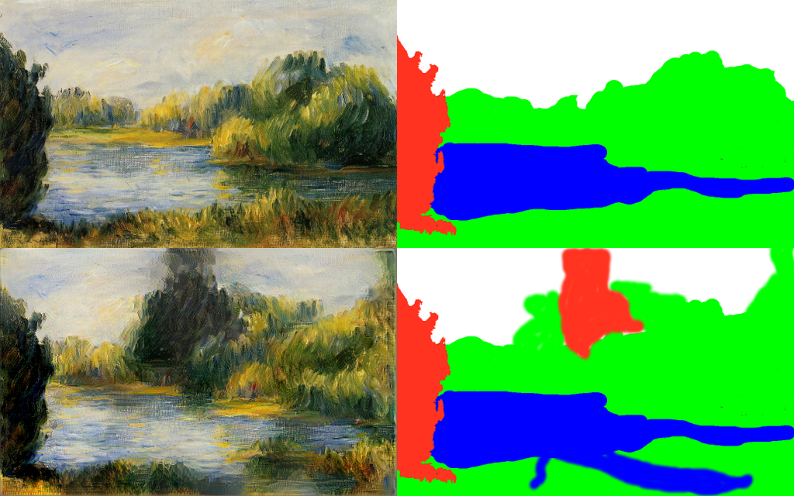
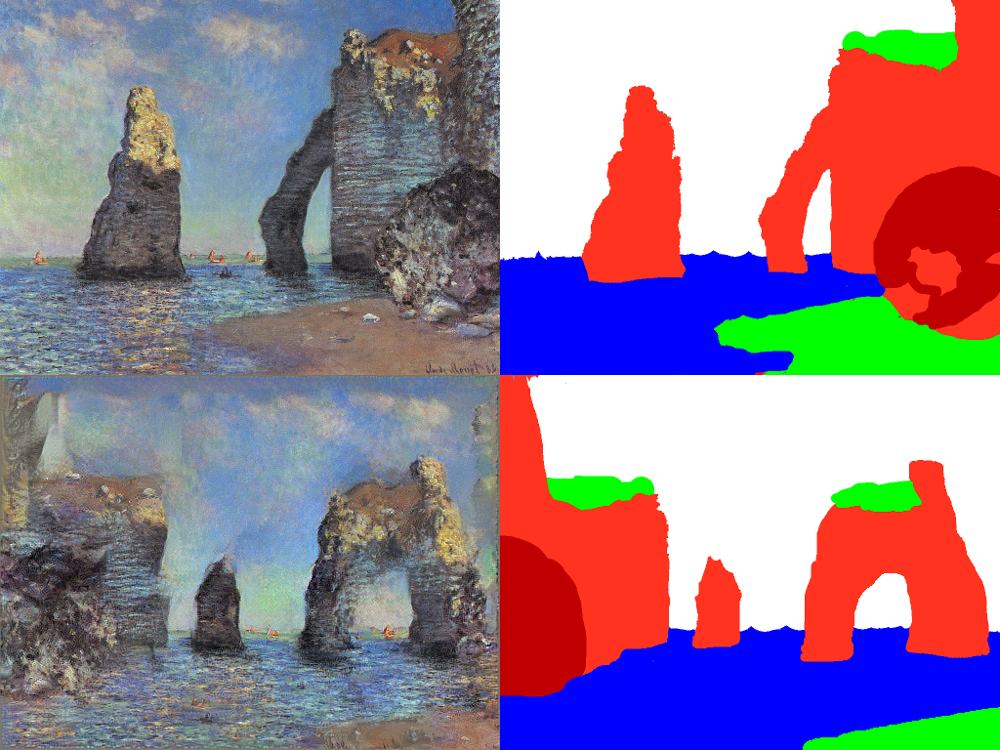

## Neural Art

This is based off of Dmitry's version of drawing with neural networks - I used pieces of it solely for local development.

It takes a few minutes to redraw the `Renoir` example using GPU, and fits in 4GB GPUs well. If you were able to work with [Justin Johnson's code for artistic style](https://github.com/jcjohnson/neural-style) then this code should work for you too. 


## Dependencies
- torch
- [torch-hdf5](https://github.com/deepmind/torch-hdf5)
- python + numpy + scipy + h5py + sklearn

Tested with python2.7 and latest `conda` packages.
## Do it yourself

First download VGG-19.
```
cd data/pretrained && bash download_models.sh && cd ../..
```

Use this script to get intermediate representations for masks. 
```
python get_mask_hdf5.py --n_colors=4 --style_image=data/Renoir/style.png --style_mask=data/Renoir/style_mask.png --target_mask=data/Renoir/target_mask.png
```

Now run doodle.
```
th fast_neural_doodle.lua -masks_hdf5 masks.hdf5
```

And here is the result.

First row: original, second -- result.

And Monet.


## Multiscale

Processing the image at low resolution first can provide a significant speed-up. You can pass a list of resolutions to use when processing. Passing `256` means that the images and masks should be resized to `256x256` resolution. With `0` passed no resizing is done. Here is an example for cmd parameters: 
- `-num_iterations 450,100 -resolutions 256,0`
Which means: work for 450 iterations at `256x256` resolution and 100 iterations at original. 

`Monet` and `Renoir` examples take ~1.5 min to process with these options. 

## Style transfer

You can also provide target image to use in content loss (in the same way as in neural artisctic style algorithm) via `--target_image` option of `get\_mask\_hdf5.py` script.

Example:
```
python get_mask_hdf5.py --n_colors=4 --style_image=data/Renoir/style.png --style_mask=data/Renoir/style_mask.png --target_mask=data/Renoir/creek_mask.jpg --target_image=data/Renoir/creek.jpg
th fast_neural_doodle.lua -masks_hdf5 masks.hdf5
```


Upper left: target image. Upper right: neural doodle with target image, i.e. both the masks and content loss were used. Lower left: regular neural doodle without content loss. Lower right: stylization without masks, with high style weight, obtained via [neural style code](https://github.com/jcjohnson/neural-style). With high style weight, stylization tends to mix unrelated parts of image, such as patches of grass floating in the sky on last picture. Neural doodle with content loss allows to generate highly stylized images without this problem.

## Misc
- Supported backends: 
	- nn (CPU/GPU mode)
	- cudnn
	- clnn (not tested yet..)
 
- When using `-backend cudnn` do not forget to switch `-cudnn_autotune`.

## Acknowledgement

The code is heavily based on [Justin Johnson's great code](https://github.com/jcjohnson/neural-style) for artistic style, and Dmitry's version of it.

## Citation

1.
```
@misc{Johnson2015,
  author = {Johnson, Justin},
  title = {neural-style},
  year = {2015},
  publisher = {GitHub},
  journal = {GitHub repository},
  howpublished = {\url{https://github.com/jcjohnson/neural-style}},
}

```

2.
```
@misc{Ulyanov2016fastdoodle,
  author = {Ulyanov, Dmitry},
  title = {Fast Neural Doodle},
  year = {2016},
  publisher = {GitHub},
  journal = {GitHub repository},
  howpublished = {\url{https://github.com/DmitryUlyanov/fast-neural-doodle}},
}
```
