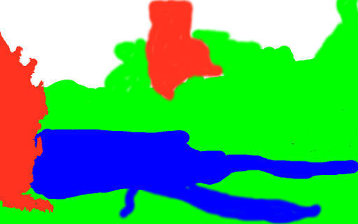
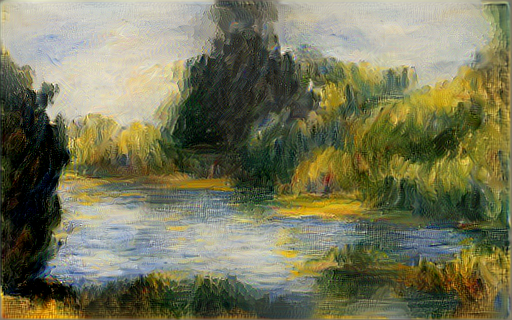

## Fast neural doodle

This is my try on drawing with neural networks, which is much faster than [Alex J. Champandards version](https://github.com/alexjc/neural-doodle), and similar in quality. This approach is based on [neural artistic style method](http://arxiv.org/abs/1508.06576) (L. Gatys), whereas Alexs version uses [CNN+MRF approach](http://arxiv.org/abs/1601.04589) of Chuan Li.

It takes several minutes to redraw `Renoir` example using GPU and it will easily fit in 4GB GPUs. If you were able to work with [Justin Johnsons code for artistic style](https://github.com/jcjohnson/neural-style) then this code should work for you too. 

*For now the code tested only for GPU cuda mode. *
## Do it yourself

First download VGG-19.
```
cd data/pretrained && bash download_models.sh && cd ../..
```

Use this script to get intermediate representations for masks. 
```
python get_mask_hdf5.py --n_colors=4 --style_image=data/Renoir/style.png --style_mask=data/Renoir/style_mask.png --target_mask=data/Renoir/target_mask.png
```

```
th neural_style.lua - -vgg_no_pad
```
And here is the result.






The code is heavily based on [Justin Johnsons great code](https://github.com/jcjohnson/neural-style) for artistic style.